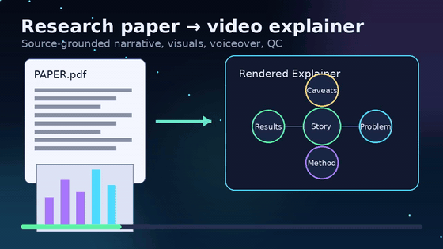
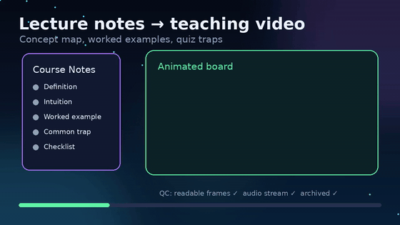
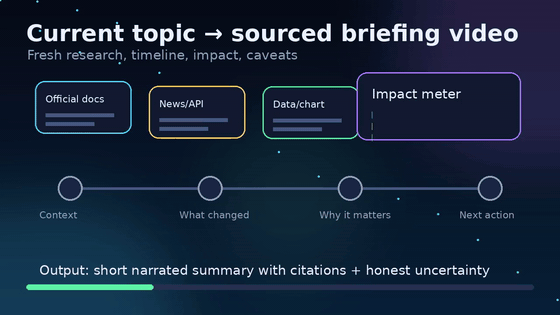

# Video Production Agent Skill

Turn an AI agent into a full-stack educational video producer: research, storyboard, narration, animated visuals, render, QC, archive, and delivery.

This is built for requests like:

- “Make a video explaining this research paper.”
- “Turn these lecture notes into a pre-class video.”
- “Make a daily summary video with sources and caveats.”
- “Go all out on an explainer with Manim visuals and narration.”

## Showcase

These are lightweight README previews of the kinds of workflows the skill drives. Full generated videos live beside each GIF as MP4s.

| Research paper explainer | Lecture recap | Current-topic briefing |
|---|---|---|
|  |  |  |
| [MP4](examples/videos/paper-explainer-demo.mp4) | [MP4](examples/videos/lecture-recap-demo.mp4) | [MP4](examples/videos/current-topic-demo.mp4) |

## What it does

`video-production` gives agents a repeatable production workflow:

1. Create a durable job workspace.
2. Pull or extract source material.
3. Build a source-grounded production brief.
4. Write segmented narration.
5. Generate TTS voiceover.
6. Produce Manim/ffmpeg/PIL visuals.
7. Sync animation timing to audio.
8. Render and mux final MP4.
9. QC frames and audio stream.
10. Archive and optionally host the deliverable.

## Repository layout

```text
skills/video-production/
├── SKILL.md
├── scripts/
│   ├── init_video_job.py
│   ├── archive_video.py
│   └── host_video.py
└── references/
    ├── production-standards.md
    └── source-playbooks.md

dist/
├── video-production.skill
└── video-production.zip

examples/videos/
├── paper-explainer-demo.mp4 / .gif
├── lecture-recap-demo.mp4 / .gif
└── current-topic-demo.mp4 / .gif
```

## Install

### OpenClaw

```bash
git clone https://github.com/Aaryan-Kapoor/video-production-skill.git
mkdir -p /path/to/openclaw-workspace/skills
cp -R video-production-skill/skills/video-production /path/to/openclaw-workspace/skills/
```

Start a new OpenClaw session so the skill snapshot reloads.

### AgentSkills / Claude-style upload

Use either packaged artifact:

- [`dist/video-production.skill`](dist/video-production.skill)
- [`dist/video-production.zip`](dist/video-production.zip)

Both archives contain a root `video-production/` folder with `SKILL.md`, `scripts/`, and `references/`.

### Gemini / generic agents

Load `skills/video-production/SKILL.md` and keep the sibling `scripts/` and `references/` directories available.

```bash
gemini skills install ./skills/video-production
```

## Requirements

Required:

- Python 3.10+
- ffmpeg + ffprobe

Recommended:

- Manim for animated diagrams/equations
- A TTS stack such as Kokoro, OpenAI TTS, ElevenLabs, or Piper
- poppler-utils for paper/PDF extraction
- Pillow for image/crop workflows
- Tailscale for private one-file hosting fallback

Set `VIDEO_PRODUCTION_ROOT` to control where generated jobs live. Default: `~/video-productions`.

## Quick test

```bash
export VIDEO_PRODUCTION_ROOT="$PWD/.video-productions"
python skills/video-production/scripts/init_video_job.py "Attention explainer" --prompt "Make a short video about attention"
```

Package locally:

```bash
./scripts/package.sh
```

## Safety

This skill can lead agents to run local scripts and media commands. Review the skill before enabling it, keep secrets out of the skill folder, and only host files you intend to share.

## License

MIT
